# wood2pcb

Universal set of adapters from wood to common open source circuit boards, including Arduino UNO, Arduino Mega, Raspberry Pi, Pi Pico, and Adafruit Circuit Playground Express

 - [woodduino.STL](woodduino.STL)
 - [woodpi.STL](woodpi.STL)
 - [woodpico.STL](woodpico.STL)
 - [woodexpress.STL](woodexpress.STL)

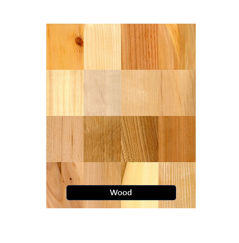
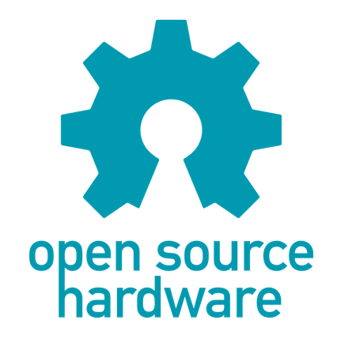
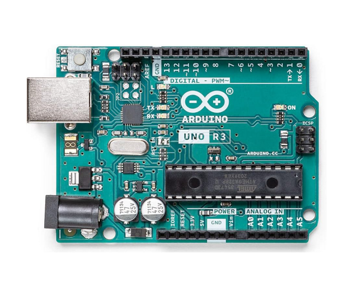
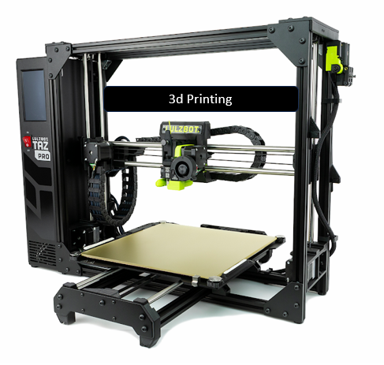
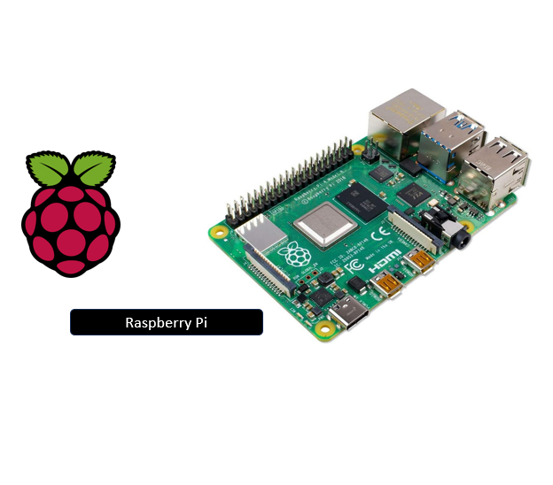
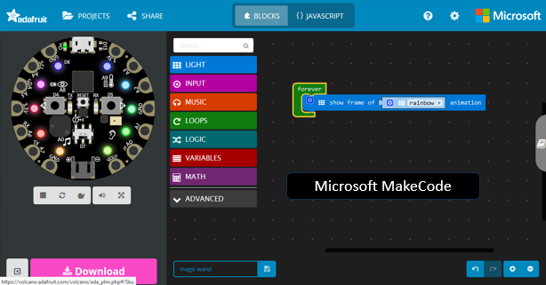
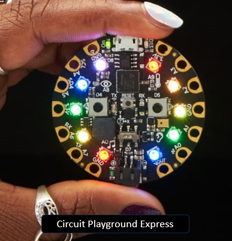
 
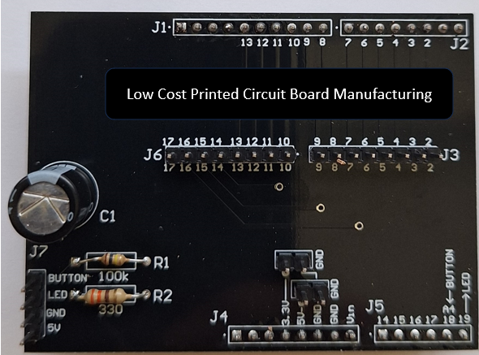

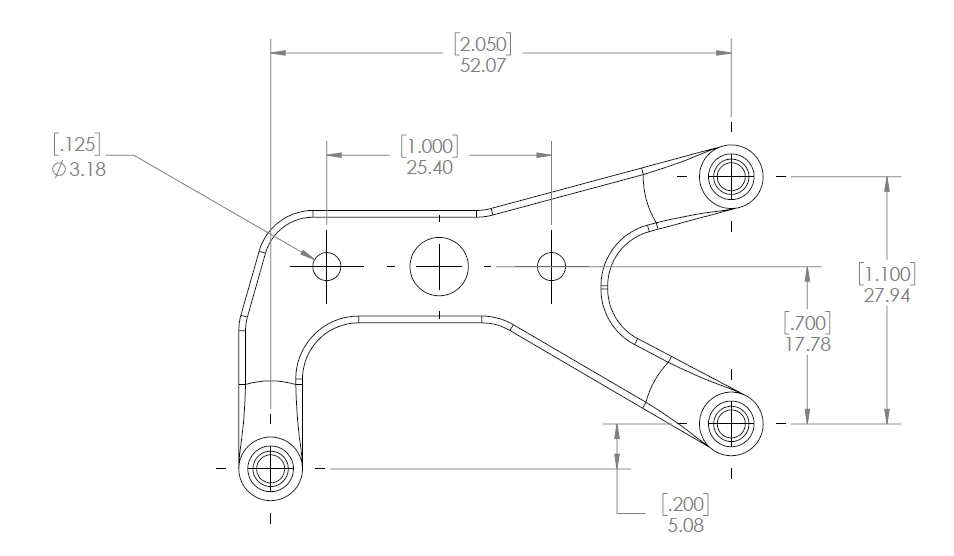
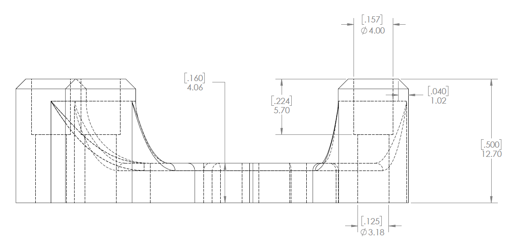

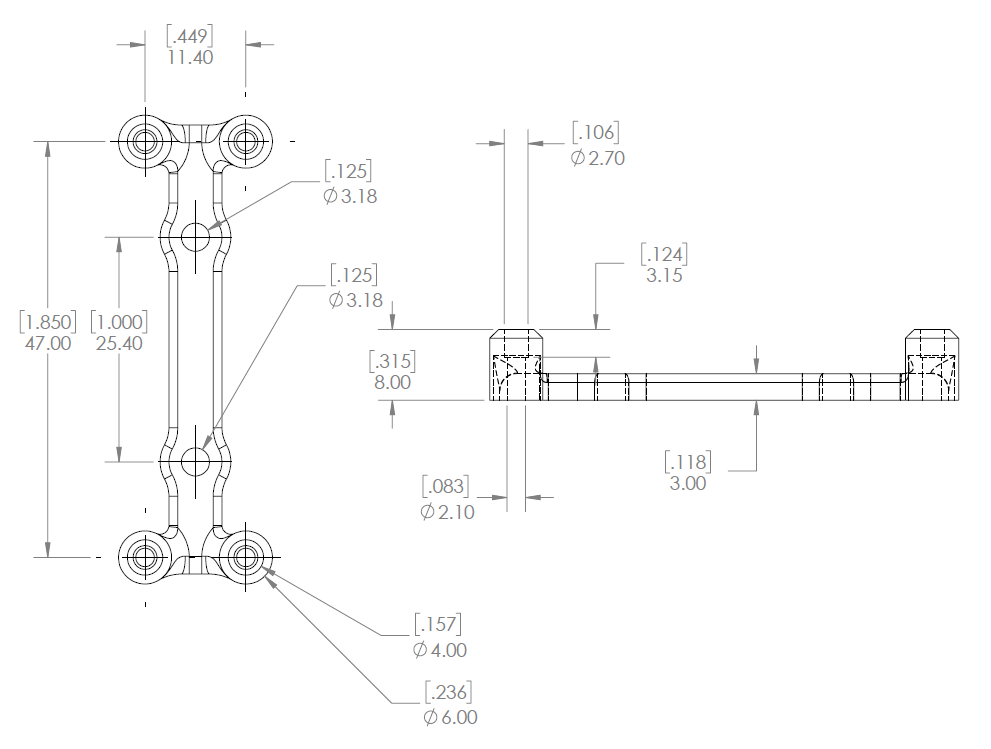
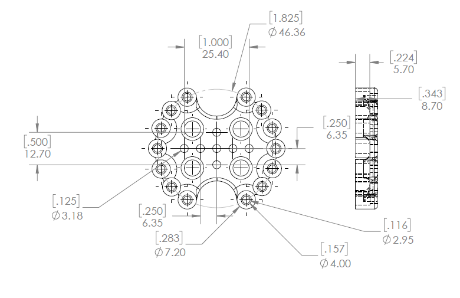

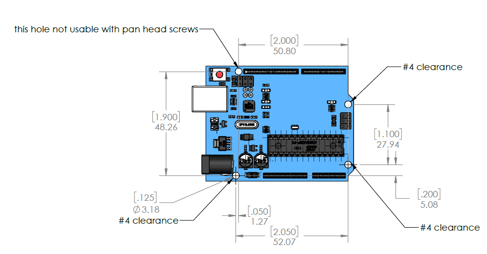
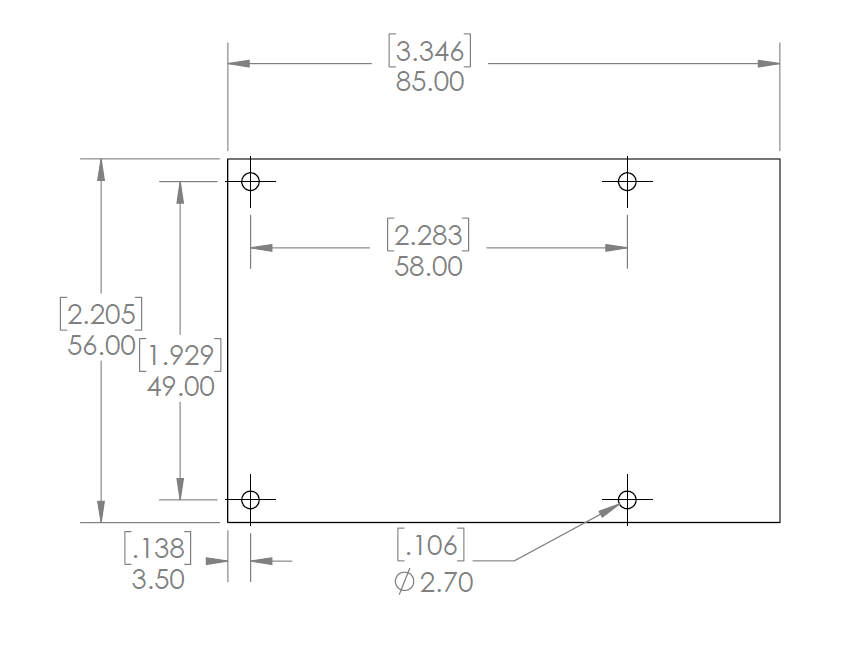
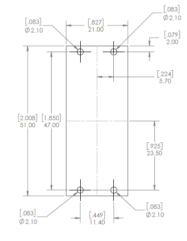
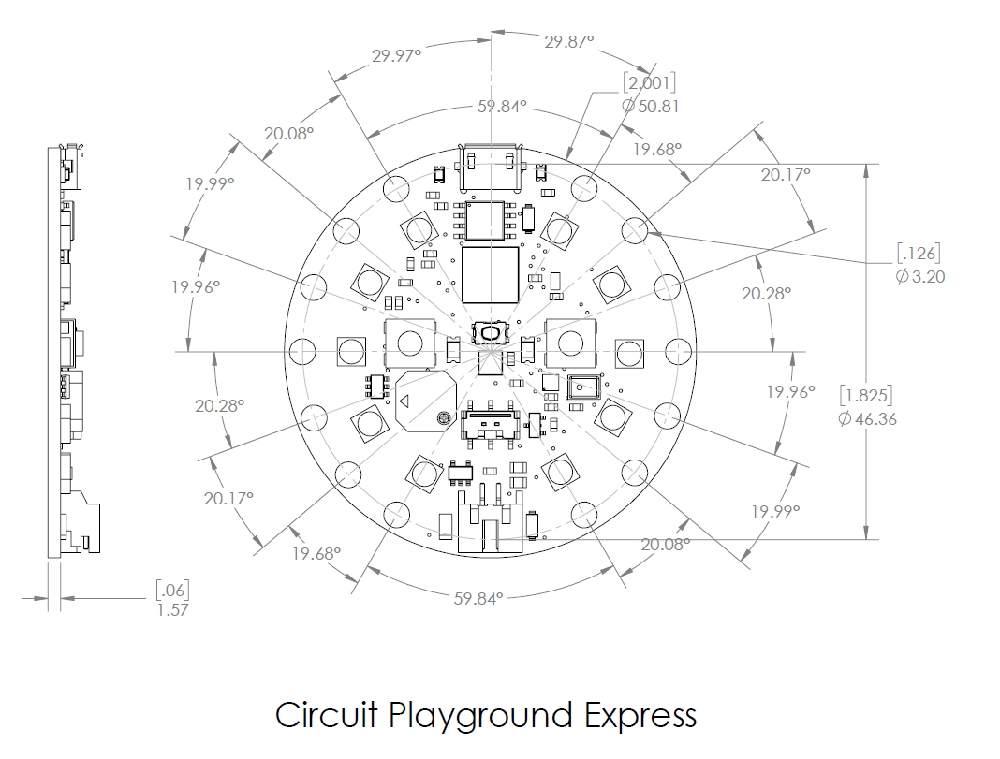
