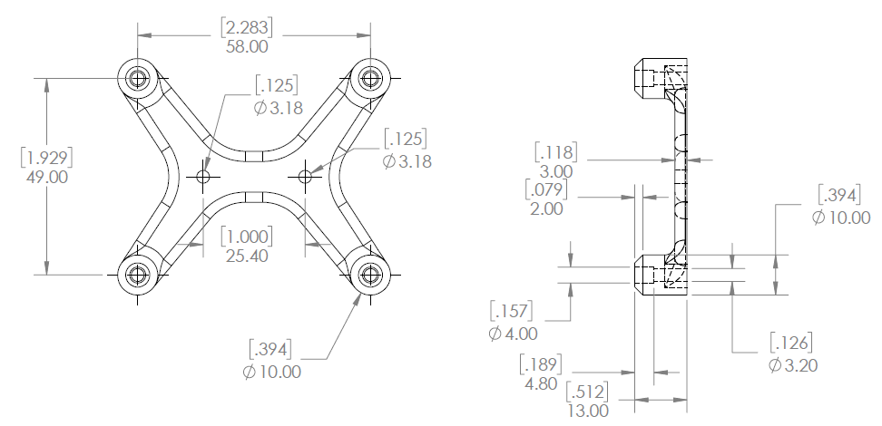

# wood2pcb

Universal set of adapters from wood to common open source circuit boards, including Arduino UNO, Arduino Mega, Raspberry Pi, Pi Pico, and Adafruit Circuit Playground Express.

 - [woodduino.STL](woodduino.STL)
 - [woodpi.STL](woodpi.STL)
 - [woodpico.STL](woodpico.STL)
 - [woodexpress.STL](woodexpress.STL)
 - [Link to buy Ruthex 4-40 Thread Inserts](https://www.3djake.com/ruthex/threaded-insert-4-40-unc-100-pieces)
 - [4-40 1/4 inch screws from McMaster Carr](https://www.mcmaster.com/91772A106/)
 - [Link to buy Ruthex M2.5 Thread Inserts](https://www.3djake.com/ruthex/threaded-insert-m25-70-pieces)
 - [M2.5 x 6 mm screws from McMaster Carr](https://www.mcmaster.com/90116A110/)
 - [Link to buy Ruthex M2 Thread Inserts](https://www.3djake.com/ruthex/threaded-insert-m2-70-pieces)
 - [M2 x 6 mm screws from McMaster Carr](https://www.mcmaster.com/90116A010/)

 

Wood is a material that has been used for many thousands of years to build the full range of products of the human species.  It remains a central element of housing construction, tools, musical instruments, boats, scientific instruments, and numerous other products.  It can be used for extremely low cost rapid prototyping even for a single unit, and can easily scale up to products with billions of units shipped.  In modern open source product manufacturing, we transmit digital files which replicate physical things.  For very simple wood products, this can be as simple as a hand drawing with dimensions, which anyone with a ruler, a square, a pen, a drill and a saw can copy, leading to extremely low friction replication of products.

In open source hardware, product creators construct sets of media files which taken together can replicate all the elements of a product.  The work here is about joining open source wood products with open source electronics products to make whole product systems.

The Arduino is an open source hardware platform that has vastly lowered the barrier to entry for building simple electronics products.  It is a circuit board with no operating system which runs the same code over and over. It can be programmed from any computer running any major operating system over a USB cable.  They usually cost about 25 dollars, but there are much cheaper versions, as well as numerous versions with added features.  As open source hardware, they can be used as the basis for original commercial products by simply editing the publicly available files for any given purpose.  The Arduino revolutionized how some people learn electronics and develop products.  The Arduino has 4 holes for 4-40 screws, although only three of them are usable.

3d printing is one of the main technologies of modern open source manufacturing. 3d printing allows a physical product to be cloned an infinite number of times by simply moving a digital file from one person with a 3d printer to the next.  3d printers are now often available for free use in public libraries as well in numerous maker spaces throughout the world. Consumer 3d printers can now be purchased for well under 1000 dollars, allowing the exact replication of parts across the whole world.  3d print files are generally shared in the [.STL format](https://en.wikipedia.org/wiki/STL_(file_format)), which builds up 3d structures out of arrays of triangles.

The [Raspberry Pi](https://www.raspberrypi.com/) is a fully functional computer on a single small cheap circuit board, running all free software.  The Raspberry Pi can be used for a vast range of products, from science instruments to musical instruments to media servers, or just regular computers.  They can run easily on off grid infrastructure like solar, taking only about 15 watts for a board to run.  They are mounted with a set of M2.5 screws.

The Raspberry Pi Pico is yet another revolution in extremely low cost, low power, small size electronics technology. They can cost under 5 dollars, are under 1x2 inches in size, and are much faster and more powerful than the Arduino.  They are usually programmed using [Circuit Python](https://circuitpython.org/), a language specifically designed for building hardware products of this kind.  They have holes for 4 M2 mounting screws.  

The [Circuit Playground Express](https://learn.adafruit.com/adafruit-circuit-playground-express) from [Adafruit](https://www.adafruit.com/) represents yet another revolution in low cost rapid hardware prototyping.   This circuit board has sound output, accelerometers, sensors, and a spectacular array of fully programmable colored lights around the outside. It has bare exposed copper holes which can be used to sew it into textile products by means of conducting thread, which allow it to be made into products without the use of soldering or custom circuit boards.  This union of textiles with circuit boards is part of what inspired the project to more smoothly unify wood with standard open source circuit boards.

[MakeCode](https://makecode.adafruit.com/) is a language which allows people to program the Circuit Playground Express with purely graphical code, dragging and dropping graphical components that make up a program. It was created by Microsoft and adapted by Adafruit for the specific platform.

 

Self-replicating media is the basis for this whole system of technology.  The prototype self-replicating media is life itself. Life replicates the information stored in the DNA/RNA information system, along with the whole vast array of living things which are created from this encoded information.  If free hardware is to scale up to all of Humanity, we aim to create information technology which mimics the replication aspects of living systems.

Cheap and rapidly produced printed circuit bards are a major driver of technological progress in open source hardware product development.  Circuit boards can be as cheap as 1 or 2 dollars each, delivered in a couple days, even in volumes of a dozen or so.  In larger volumes the cost can drop to a few cents a board.  They can be easily remixed and modified in open source designs, with designers constantly adding to the work of other designers.  As the amount of sharing of designs increases, the networked power of the open source hardware development community should eventually start to see exponential speedups in progress as our network of sharing becomes connected in more and more complex ways.

# WoodDuino

This is a bracket that connects the Arduino Uno and the Arduino Mega to anything with a pair of #4 screws spaced 1 inch apart.  It is used to mount the Arduino Uno to any kind of wood object with wood screws, or to metal objects with 4-40 threaded holes or plastic parts with thread inserts via machine screws.  The part requires the use of 3 brass thread inserts, which can be inserted using a soldering iron set to 250 C, preferably with some kind of apparatus which allows for motion of the iron constrained into the vertical direction.  It takes 4 grams of material, and prints in about 18 minutes.

 - [woodduino.STL](woodduino.STL)
 - [Link to buy Ruthex #4-40x5,7 Thread Inserts](https://www.3djake.com/ruthex/threaded-insert-4-40-unc-100-pieces)
 - [4-40 1/4 inch screws from McMaster Carr](https://www.mcmaster.com/91772A106/)
 - [woodduino.SLDPRT](woodduino.SLDPRT)
 - [woodduino.SLDDRW](woodduino.SLDDRW)
 - [woodduino.pdf](woodduino.pdf)
 - [woodduino.STEP](woodduino.STEP)

# WoodPi

This is a bracket that connects the Raspberry Pi single board computer to anything with a pair of #4 screws spaced 1 inch apart.  It is used to mount the Raspberry Pi to any kind of wood object with wood screws, or to metal objects with 4-40 threaded holes or plastic parts with thread inserts via machine screws.  The part requires the use of 4 M2.5 brass thread inserts, which can be inserted using a soldering iron set to 250 C, preferably with some kind of apparatus which allows for motion of the iron constrained into the vertical direction.  It takes 7 grams of material, and prints in about 24 minutes.

 - [woodpi.STL](woodpi.STL)
 - [Link to buy Ruthex M2.5 Thread Inserts](https://www.3djake.com/ruthex/threaded-insert-m25-70-pieces)
 - [M2.5 x 6 mm screws from McMaster Carr](https://www.mcmaster.com/90116A110/)
 - [woodpi.SLDPRT](woodpi.SLDPRT)
 - [woodpi.SLDDRW](woodpi.SLDDRW)
 - [woodpi.pdf](woodpi.pdf)
 - [woodpi.STEP](woodpi.STEP)

# WoodExpress

This is a bracket that connects the Adafruit Circuit Playground Express to anything with a pair of #4 screws spaced 1 inch apart.  It is used to mount the Adafruit Circuit Playground Express to any kind of wood object with wood screws, or to metal objects with 4-40 threaded holes or plastic parts with thread inserts via machine screws.  The part requires the use of 14 4-40 brass thread inserts, which can be inserted using a soldering iron set to 250 C, preferably with some kind of apparatus which allows for motion of the iron constrained into the vertical direction.  It takes 7 grams of material, and prints in about 28 minutes.  These screw terminals allow the user to connect wires without soldering or use of a breadboard by screwing wires onto the bare gold plated copper.  Not all screws must be connected, two is generally sufficient to hold the board in place, but all 14 allows for maximum flexibility in connecting wires to the board. 

 - [woodexpress.STL](woodexpress.STL)
 - [Link to buy Ruthex #4-40x5,7 Thread Inserts](https://www.3djake.com/ruthex/threaded-insert-4-40-unc-100-pieces)
 - [4-40 1/4 inch screws from McMaster Carr](https://www.mcmaster.com/91772A106/)
 - [woodexpress.SLDPRT](woodexpress.SLDPRT)
 - [woodexpress.SLDDRW](woodexpress.SLDDRW)
 - [woodexpress.pdf](woodexpress.pdf)
 - [woodexpress.STEP](woodexpress.STEP)

# WoodPico

This is a bracket that connects the Raspberry Pi Pico microcontroller to anything with a pair of #4 screws spaced 1 inch apart.  It is used to mount the Pi Pico to any kind of wood object with wood screws, or to metal objects with 4-40 threaded holes or plastic parts with thread inserts via machine screws.  The part requires the use of 4 M2 brass thread inserts, which can be inserted using a soldering iron set to 250 C, preferably with some kind of apparatus which allows for motion of the iron constrained into the vertical direction.  It takes 2 grams of material, and prints in about 10 minutes.

 - [woodpico.STL](woodpico.STL)
 - [Link to buy Ruthex M2 Thread Inserts](https://www.3djake.com/ruthex/threaded-insert-m2-70-pieces)
 - [M2 x 6 mm screws from McMaster Carr](https://www.mcmaster.com/90116A010/)
 - [woodpico.SLDPRT](woodpico.SLDPRT)
 - [woodpico.SLDDRW](woodpico.SLDDRW)
 - [woodpico.pdf](woodpico.pdf)
 - [woodpico.STEP](woodpico.STEP)

# Board Dimensions Of the Products

These are the dimensions for the Arduino UNO:

These are the hole dimensions for the Raspberry Pi:

These are the hole dimensions for the Raspberry Pi Pico:

These are the hole dimensions for the Adafruit Circuit Playground Express:

